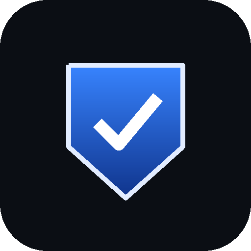
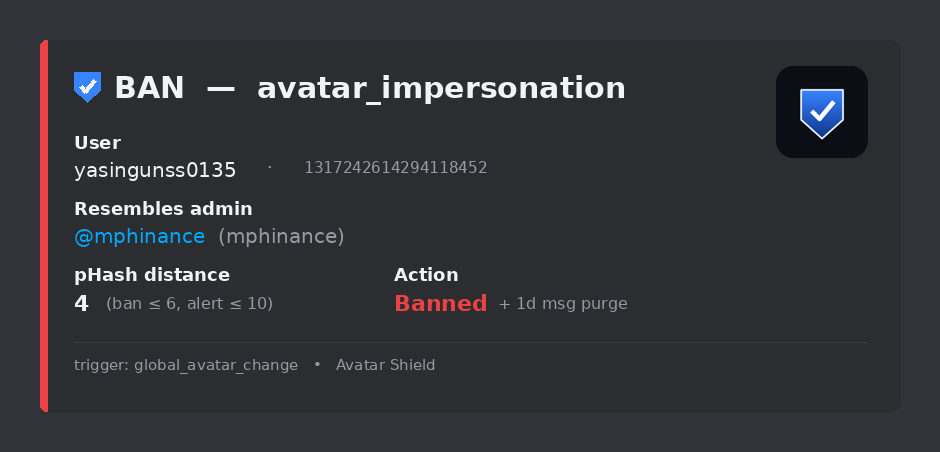

<div align="center">



# 🛡️ Avatar Shield

**Catches scammers who copy your admins' _profile pictures_ to impersonate them.**

Name filters change the name. Scammers don't — they change the _face_.
Avatar Shield fingerprints every admin's avatar and flags anyone wearing a copy.


<br/><br/>

[](https://railway.com/new/template?template=https%3A%2F%2Fgithub.com%2Ftradernetwork%2Favatar-shield&envs=DISCORD_BOT_TOKEN%2CMOD_LOG_CHANNEL_ID%2CENFORCE_BAN&DISCORD_BOT_TOKENDesc=Bot+token+from+the+Discord+Developer+Portal&MOD_LOG_CHANNEL_IDDesc=Channel+ID+where+alerts+post&ENFORCE_BANDesc=Leave+false+to+start+in+alert-only+mode&ENFORCE_BANDefault=false)

<sub>One click → Railway clones this repo, prompts for your token + channel, and boots it. Still do Phase 1 (create the app + turn on Server Members Intent) first. 👇</sub>

</div>

---

<div align="center">

<br/><em>What your mods see the moment an impersonator shows up.</em>
</div>

---

## 🎯 The problem

Impersonation is the **#1 scam vector** in trading & crypto Discords. The play is
always the same:

1. A scammer copies an admin's **profile picture** (and often a look-alike name).
2. They DM your members pretending to be that admin — "claim your allocation
   here," "verify your wallet," "I'm running a private group."
3. Members trust the face. Money leaves.

**MEE6, Dyno, and Wick filter _names_ — not faces.** So the scammer just tweaks
the name (`RealAdmin` → `ReaIAdmin` with a capital i, or a totally different
name) and keeps the picture. Your name filter waves them right through.

Avatar Shield closes that gap. 👇

## ⚙️ How it works

- 🧬 **Perceptual hashing.** Every server admin's avatar is fingerprinted with a
  64-bit [pHash](https://en.wikipedia.org/wiki/Perceptual_hashing). Unlike a
  file checksum, pHash still matches after the scammer **re-encodes, resizes, or
  lightly crops** the image.
- 👀 **Watches the right events.** On every member **join**, **avatar change**,
  and **global avatar swap**, the newcomer's avatar is hashed and compared to the
  admin set. Close match → alert.
- 📏 **Two tiers.** A very close match (Hamming distance ≤ `6`) is **ban-tier**;
  a looser resemblance (≤ `10`) is **alert-tier** (posted for a human to review,
  never actioned).
- 🔁 **Zero maintenance.** The admin fingerprint set is derived automatically
  from anyone with the **Administrator** permission and refreshed hourly. No
  database, no config file, no admin list to keep updated.

> **Free tier = alert-only.** Out of the box it **never bans, mutes, or touches
> anyone** — it just tells your mods. Flip one env var to `true` when you're
> ready to let it auto-ban.

---

## 🚀 Setup — start to finish (~10 min)

Three phases: **create the app → invite it → deploy it.**

### 1️⃣ Create the Discord app

1. Go to the [Developer Portal](https://discord.com/developers/applications) →
   **New Application**. Name it `Avatar Shield`. Create.
2. **Bot** tab → **Reset Token** → **copy it** (this is a secret — never commit
   or share it).
3. ⚠️ **Same page → Privileged Gateway Intents → turn ON `SERVER MEMBERS
   INTENT`.** *Everyone forgets this. Without it the bot is deaf to joins and
   avatar changes.*
4. **General Information** → copy the **Application ID** (for the invite link).

### 2️⃣ Invite it

Generate the invite URL:

```bash
python make_invite.py <APPLICATION_ID>
```

That prints an invite with **View Channels, Send Messages, Embed Links, Read
Message History, and Ban Members**. (Ban is included so you never have to
re-invite when you enable auto-ban — the bot won't touch anyone until you set
`ENFORCE_BAN=true`.) Want a zero-ban invite to start? Add `--alert`.

Send the URL to the server owner → **Authorize**. Then in the server:

- 🪜 **Drag the `Avatar Shield` role _above_ the roles it will ban** (Server
  Settings → Roles). Discord won't let a bot ban anyone whose top role sits
  above the bot's.
- 📢 Pick a **mod-log channel** for alerts, enable Developer Mode, right-click it
  → **Copy Channel ID**.

> 🧩 **Heads-up on private channels:** if your mod-log lives in a locked category
> where `@everyone` is denied, you must add the **bot's role** to that channel
> and set **View Channel + Send Messages + Embed Links** to explicit green ✅
> (a gray "neutral" toggle inherits the `@everyone` deny). The bot's role keeps
> the name it had *when invited*, so look for that exact name.

### 3️⃣ Deploy it (always-on host)

The bot holds a live gateway connection — it can't run serverless/cron. Pick one:

<details open>
<summary>🚂 <b>Railway — one click (easiest, ~$5/mo)</b></summary>

[](https://railway.com/new/template?template=https%3A%2F%2Fgithub.com%2Ftradernetwork%2Favatar-shield&envs=DISCORD_BOT_TOKEN%2CMOD_LOG_CHANNEL_ID%2CENFORCE_BAN&DISCORD_BOT_TOKENDesc=Bot+token+from+the+Discord+Developer+Portal&MOD_LOG_CHANNEL_IDDesc=Channel+ID+where+alerts+post&ENFORCE_BANDesc=Leave+false+to+start+in+alert-only+mode&ENFORCE_BANDefault=false)

The button clones this repo, prompts for your **token + mod-log channel**
(`ENFORCE_BAN` pre-filled to `false`), and boots it — Railway reads
`railway.json` + the `Dockerfile`. Watch the deploy logs for
`Avatar Shield online ...`.

Prefer to wire it by hand? [railway.app](https://railway.app) → **New Project**
→ **Deploy from GitHub repo** → pick this repo → add the three variables under
**Variables**.
</details>

<details>
<summary>🪂 <b>Fly.io</b></summary>

```bash
fly launch --no-deploy
fly secrets set DISCORD_BOT_TOKEN=... MOD_LOG_CHANNEL_ID=... ENFORCE_BAN=false
fly deploy
```
Set `min_machines_running = 1` so it never scales to zero.
</details>

<details>
<summary>🐳 <b>Any Docker host / VPS</b></summary>

```bash
cp .env.example .env      # fill in the three values
docker build -t avatar-shield .
docker run -d --restart=unless-stopped --env-file .env --name avatar-shield avatar-shield
```
</details>

---

## 🔧 Config reference

| Env var | Required | Default | Meaning |
|---|:---:|:---:|---|
| `DISCORD_BOT_TOKEN` | ✅ | — | Bot token from the Developer Portal |
| `MOD_LOG_CHANNEL_ID` | ✅ | — | Channel ID where alerts / ban cards post |
| `ENFORCE_BAN` | | `false` | `true` = auto-ban ban-tier matches (needs Ban perm + role position) |
| `THRESHOLD_BAN` | | `6` | pHash distance ≤ this ⇒ **ban** tier |
| `THRESHOLD_ALERT` | | `10` | pHash distance ≤ this ⇒ **alert** tier (review) |

Thresholds are out of 64 bits — **lower = stricter.** Getting false positives?
Lower `THRESHOLD_ALERT`. Missing near-copies? Raise it, carefully.

## 🔨 Turning on auto-ban

Run it alert-only for a few days and watch the mod-log. When you trust it:

1. Confirm the `Avatar Shield` role sits **above** the roles it would ban.
2. Set `ENFORCE_BAN=true` and redeploy/restart.

Ban-tier matches now get banned automatically (with a 1-day message purge);
alert-tier matches still just post for review.

---

## 🕳️ Know the loophole → [read `docs/MEMBER_SAFETY.md`](docs/MEMBER_SAFETY.md)

Avatar Shield stops impersonators who **join your server**. The smart ones don't
join at all — they scrape your member list from a throwaway account and DM your
members from **outside**, so no bot ever sees them. **No Discord bot can read or
block those DMs — that's a hard platform privacy limit, not a gap in this tool.**

The one thing that actually beats it is **your members knowing the tells.** We
wrote a drop-in, copy-paste safety notice for you to pin — the headline rule:

> ✅ **A real admin shares _this server_ with you. Check "Mutual Servers" on
> anyone who DMs you claiming to be staff. No mutual = impersonator. Block.**

👉 **[Grab the pinned-message copy in `docs/MEMBER_SAFETY.md`.](docs/MEMBER_SAFETY.md)**

---

## 🩺 Troubleshooting

| Symptom | Fix |
|---|---|
| Online but never reacts | Server Members Intent is **off** (Phase 1.3), or the impersonator has Administrator (admins are the *protected* set, never flagged) |
| `mod-log channel ... not found` | Wrong `MOD_LOG_CHANNEL_ID`, or the bot can't see it — grant its role View Channel + Send Messages on that channel |
| `ban forbidden — check bot role position` | The `Avatar Shield` role is below the person's role — drag it up |
| Nothing at all | Wrong token, or the app didn't actually join (Server Settings → Integrations) |

---

## 📜 License

MIT. Free to self-host and hand to other server owners.

<sub>Built by [Trader Network](https://github.com/tradernetwork). The hosted paid
tier adds protected-member ban-capping (so a mis-fire can't nuke a real
admin/subscriber), auto-tuning, and a dashboard.</sub>
